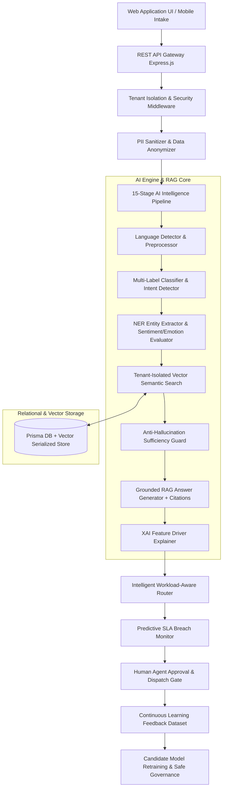

# AI-Based Multi-Organization Complaint Classification & Resolution System

A production-grade, enterprise-ready **AI Multi-Tenant Complaint Classification, Workload Routing, and Grounded RAG Resolution System**. Designed for real-world multi-tenant deployments (Banks, Hospitals, Universities, Telecoms) with strict tenant data isolation, PII sanitization, 15-stage AI classification, predictive SLA management, and Human-in-the-Loop model retraining governance.

---

## 🏗️ Architecture Overview



---

## ⚙️ Key Technical Features

1. **Multi-Tenant Isolation**: Mandatory `orgId` scoping on every SQL query (`where: { orgId }`), preventing cross-tenant data leakage between Bank, Hospital, and University tenants.
2. **15-Stage AI Intelligence Engine**: Language detection, PII sanitization, multi-label classification, intent extraction, NER entity extraction, sentiment/emotion evaluation, priority scoring, duplicate detection, and XAI feature driver weights.
3. **Tenant-Filtered Grounded RAG Engine**: Recursive text chunking, 384-D vector embeddings, cosine similarity search, and anti-hallucination guard (`insufficientKnowledge` abstention score $< 0.20$).
4. **Intelligent Workload-Aware Routing**: Candidate agent scoring based on required skills and active workload capacity index.
5. **Predictive SLA & Auto-Escalation**: Countdown timers, 75% SLA warning alerts, queue-depth breach prediction, and batch manager auto-escalations.
6. **Human-in-the-Loop Retraining Governance**: Agent correction logging, feedback dataset compilation, candidate vs production model evaluation, and safe promotion gates.

---

## 🚀 Quick Start & Installation

### Prerequisites
- Node.js `v18.x` or higher
- npm `v9.x` or higher

### 1. Clone & Install Dependencies
```bash
git clone https://github.com/enterprise/ai-multi-org-backend.git
cd ai-multi-org-backend
npm install
```

### 2. Configure Environment Variables
Create a `.env` file in the root directory:
```env
PORT=8000
NODE_ENV=development
DATABASE_URL="file:./dev.db"
JWT_SECRET="super-secret-enterprise-jwt-token-key-2026"
CORS_ORIGIN="*"
MODEL_VERSION="DeBERTa-v3-Mistral-RAG-v1.2"
```

### 3. Database Setup & Seeding
Initialize Prisma schema, apply migrations, and seed sample organization data:
```bash
npx prisma db push
npx prisma generate
npx ts-node -e "require('./src/seed').seedDatabase()"
```

### 4. Start the Application & UI Server
```bash
npm run dev
```
Open your browser at: **`http://localhost:8000`**

---

## 🧪 Integration Test Suite

Run the complete 17-step end-to-end integration test suite:
```bash
npx tsc
npx ts-node src/tests/run-tests.ts
```

---

## 🔑 Test Credentials (Sample Data)

The system is pre-seeded with 3 distinct organization tenants:

| Organization | Tenant Slug | Role | Email | Password |
| :--- | :--- | :--- | :--- | :--- |
| **ABC Global Bank** | `apex-bank` | Customer | `sarah@apexbank.com` | `password123` |
| **ABC Global Bank** | `apex-bank` | Support Agent | `michael@apexbank.com` | `password123` |
| **ABC Global Bank** | `apex-bank` | Org Admin | `admin@apexbank.com` | `password123` |
| **XYZ General Hospital** | `metro-hospital` | Patient | `patient@metrohospital.com` | `password123` |
| **XYZ General Hospital** | `metro-hospital` | Support Agent | `nurse.john@metrohospital.com` | `password123` |
| **XYZ General Hospital** | `metro-hospital` | Hospital Admin | `admin@metrohospital.com` | `password123` |
| **St. Jude University** | `horizon-university` | Student | `student@horizon.edu` | `password123` |
| **St. Jude University** | `horizon-university` | Support Agent | `advisor.emily@horizon.edu` | `password123` |
| **St. Jude University** | `horizon-university` | Univ Admin | `admin@horizon.edu` | `password123` |

---

## 📡 REST API Documentation

### 1. Authentication
- `POST /api/v1/auth/login`
  - **Payload**: `{ "orgSlug": "apex-bank", "email": "sarah@apexbank.com", "password": "password123" }`
  - **Response**: Returns JWT token, user profile, role, and `orgId`.

### 2. Complaint Intake & Lifecycle
- `POST /api/v1/complaints` (Headers: `Authorization: Bearer <token>`, `x-tenant-id: <orgId>`)
  - **Payload**: `{ "title": "Card Dispute", "description": "Unauthorized charge of $450..." }`
- `GET /api/v1/complaints/:id`
  - **Returns**: Complete complaint object, assigned agent, status timeline, and messages.

### 3. AI Complaint Intelligence Engine
- `POST /api/v1/complaints/:id/ai-analyze`
  - Executes 15-stage AI pipeline. Returns multi-label categories, sentiment, priority, intents, entities, and XAI feature weights.
- `GET /api/v1/complaints/:id/ai-insights`
  - Retrieves stored AI predictions and rationale.

### 4. Organization Knowledge Base & Grounded RAG
- `POST /api/v1/rag/kb-upload`
  - **Payload**: `{ "title": "Card Policy", "content": "Refunds process within 24h...", "documentType": "POLICY" }`
- `POST /api/v1/rag/resolve-complaint/:id`
  - Runs tenant-isolated vector search, anti-hallucination check, and returns grounded answer with source citations.
- `POST /api/v1/rag/approve-resolution/:id`
  - Human agent approves RAG draft response and dispatches to customer.

### 5. Intelligent Routing & Workload Assignment
- `GET /api/v1/routing/recommend/:id` — Ranks candidate agents by skill match & workload ratio.
- `POST /api/v1/routing/auto-assign/:id` — Automatically assigns top-ranked agent.
- `POST /api/v1/routing/reassign/:id` — Manually reassigns ticket between agents.
- `POST /api/v1/routing/escalate/:id` — Escalates ticket to Department Manager.

### 6. SLA & Predictive Breach Monitoring
- `GET /api/v1/sla/countdown/:id` — Retrieves real-time SLA countdown status.
- `GET /api/v1/sla/predictive-risk/:id` — Returns `predictiveBreachRisk` (`LOW`, `MEDIUM`, `HIGH`).
- `POST /api/v1/sla/batch-scan` — Scans active tickets and triggers auto-escalations.

### 7. Analytics & Emerging Issue Detection
- `GET /api/v1/analytics/org` — Total tickets, SLA %, CSAT ratings, department workloads.
- `GET /api/v1/analytics/ai` — Classification precision, human override rate, RAG acceptance rate.
- `GET /api/v1/analytics/emerging-issues` — Volume spike anomaly detection and diagnostic explanations.

### 8. HITL Learning & Model Governance
- `POST /api/v1/hitl/correction/:id` — Log agent corrections and rejections.
- `GET /api/v1/hitl/feedback-dataset` — Compile structured retraining dataset.
- `GET /api/v1/hitl/retraining-governance` — View Production vs Candidate model status.
- `POST /api/v1/hitl/promote-candidate` — Safely promote evaluated Candidate Model to Production.

---

## 🛠️ Production Deployment Guidelines

### Containerized Deployment (Docker / PM2)
Build production bundle and start server with PM2 cluster mode:
```bash
npm run build
npx pm2 start dist/server.js -i max --name "ai-complaint-backend"
```

### PostgreSQL / Vector Extension Deployment
For large scale production, replace SQLite with PostgreSQL (`pgvector` plugin) by updating `prisma/schema.prisma`:
```prisma
datasource db {
  provider = "postgresql"
  url      = env("DATABASE_URL")
}
```
Run `npx prisma db push` to synchronize PostgreSQL tables.

---

## 📄 License & System Status

System Operational & Production Verified | **Antigravity AI Platform 2026**
